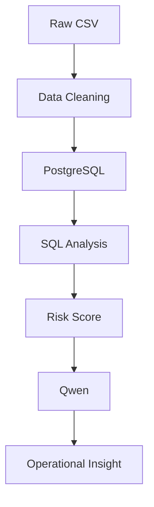

# Operational Insight Dashboard

고객 지원 티켓 데이터 기반 운영 리스크 분석 및 LLM 기반 운영 인사이트 생성 플랫폼

고객 지원 티켓 데이터를 분석해 운영 리스크를 정량화하고, 우선 대응 영역을 도출한 프로젝트입니다.  
단순 문의량 집계가 아니라 재오픈율, 처리시간, 우선순위를 결합한 Risk Score를 설계했습니다.  
SQL/Pandas 분석 결과를 Streamlit 대시보드로 시각화하고, Qwen 기반 LLM을 활용해 운영 담당자가 바로 읽을 수 있는 자연어 인사이트로 변환했습니다.  
전체 흐름은 운영 데이터 분석 → Risk Score 산출 → LLM 기반 운영 인사이트 생성입니다.

---

## 문제 정의

고객 지원 운영에서는 매일 많은 문의가 발생하지만, 단순 문의량만으로 실제 운영 리스크를 판단하기는 어렵습니다. 처리시간이 긴 문의가 반드시 가장 중요한 문의는 아닐 수 있고, 문의량이 많은 유형보다 재오픈율이 높은 유형이 더 큰 운영 비용과 고객 경험 저하를 만들 수 있습니다.

특히 Reopened 티켓은 한 번 해결된 문의가 다시 열렸다는 의미이므로, 최초 처리 품질이나 후속 조치 프로세스에 문제가 있을 가능성을 보여줍니다. 운영 담당자가 매번 SQL을 직접 실행하지 않아도 리스크가 높은 영역을 빠르게 파악하고, 개선 우선순위를 판단할 수 있는 구조가 필요했습니다.

그래서 이 프로젝트에서는 재오픈율, 처리시간, 우선순위를 결합한 Risk Score 기반 운영 우선순위 도출 시스템을 설계했습니다.

---

## 분석 목적

- 어떤 문의 유형이 가장 높은 운영 리스크를 갖는가?
- 어떤 영역에 운영 리소스를 우선 배치해야 하는가?
- 재오픈율이 높은 문의 유형은 무엇인가?
- SQL 분석 결과를 운영 인사이트로 자동 변환할 수 있는가?

---

## 데이터 Overview

<details>
<summary>데이터 세부사항</summary>

데이터 출처 : Kaggle Customer Support Ticket Satisfaction Analysis  
총 데이터 수 : 2,800건  
분석 단위 : 고객 지원 티켓

| 컬럼 | 설명 |
| --- | --- |
| `ticket_id` | 티켓 고유 ID |
| `issue_category` | 문의 유형 |
| `priority` | 티켓 우선순위 |
| `first_response_minutes` | 최초 응답까지 걸린 시간 |
| `resolution_time_hours` | 해결까지 걸린 시간 |
| `agent_experience_years` | 상담 담당자 경험 연차 |
| `reopened` | 재오픈 여부 |
| `channel` | 문의 채널 |
| `customer_satisfaction` | 고객 만족도 참고 지표 |

</details>

---

## 시스템 프로세스



<details>
<summary>파이프라인 상세 설명</summary>

Raw CSV : Kaggle에서 받은 고객 지원 티켓 데이터를 사용합니다.  
Data Cleaning : 실제 CSV 컬럼을 기준으로 날짜, 숫자, boolean 값을 정제합니다.  
PostgreSQL : 정제된 데이터를 `customer_support_tickets` 테이블에 적재합니다.  
SQL Analysis : 문의 유형, 채널, 우선순위, 재오픈율, 처리시간을 기준으로 운영 지표를 계산합니다.  
Risk Score : 재오픈율, 처리시간, 우선순위를 결합해 운영 우선순위를 산출합니다.  
Qwen : SQL 분석 결과를 입력으로 받아 운영 담당자가 읽을 수 있는 자연어 인사이트를 생성합니다.  
Operational Insight : 운영 리스크 요약, 우선 대응 영역, 개선안을 보고서 형태로 제공합니다.

</details>

---

## EDA

### 1. Operational Overview


#### 분석 결과

- Total Tickets : 2,800
- Avg Resolution Time : 36.56h
- Avg First Response Time : 123.02min
- Reopened Rate : 49.54%

#### 인사이트

전체 재오픈율이 49.54%로 나타났습니다. 이는 약 절반의 티켓이 다시 열렸다는 의미이며, 단순 처리 완료 건수만으로는 운영 품질을 판단하기 어렵다는 점을 보여줍니다.

운영 관점에서는 최초 응답 속도뿐 아니라 해결 품질, 후속 조치, 상담 기록 관리까지 함께 점검해야 합니다. 재오픈율은 운영 효율성과 고객 경험을 동시에 보여주는 핵심 리스크 지표로 볼 수 있습니다.

---

### 2. 문의 유형별 평균 처리시간


#### 분석 결과

문의 유형별 평균 처리시간은 Account 37.66시간, Other 37.07시간, Technical 36.63시간, Delivery 36.39시간, Billing 35.05시간 순으로 나타났습니다.

#### 인사이트

Account와 Other는 평균 처리시간이 상대적으로 길어 운영 병목 가능성이 있습니다. 다만 처리시간만으로 우선순위를 정하면 재오픈율이나 우선순위가 반영되지 않기 때문에 실제 운영 리스크 판단에는 한계가 있습니다.

따라서 처리시간은 독립 지표가 아니라 재오픈율, Priority와 함께 해석해야 합니다.

---

### 3. Risk Score 분석


#### 분석 결과

- Other : 0.8536
- Delivery : 0.6431
- Technical : 0.6105

#### 인사이트

Other가 가장 높은 Risk Score를 기록했습니다. 이는 단순히 Other 문의 자체가 위험하다는 의미가 아니라, 문의 분류 체계가 충분히 세분화되지 않았을 가능성을 시사합니다.

Other에 다양한 유형의 문의가 섞여 있으면 반복 이슈를 식별하기 어렵고, 담당자 교육이나 자동응답, 처리 가이드를 정교하게 설계하기 어렵습니다. 따라서 Other 재분류는 운영 리스크를 줄이기 위한 우선 개선 과제로 해석할 수 있습니다.

Delivery와 Technical도 Risk Score가 높게 나타났습니다. 두 영역은 재오픈율과 처리 부담이 함께 존재할 가능성이 있어 처리 가이드 표준화와 FAQ 보강의 우선순위가 높습니다.

---

## Risk Score 설계

운영팀은 단일 지표만으로 우선순위를 판단하기 어렵습니다. 문의량은 많지만 재오픈율이 낮은 유형이 있을 수 있고, 처리시간은 길지만 실제 Priority가 낮은 유형도 있을 수 있습니다.

그래서 이 프로젝트에서는 운영 리스크를 더 실무적으로 판단하기 위해 Reopened Rate, Resolution Time, Priority를 결합한 Risk Score를 설계했습니다.

- Reopened Rate : 처리 품질과 고객 경험 리스크
- Resolution Time : 운영 처리 부담과 병목 가능성
- Priority : 대응 중요도와 긴급도

```text
Risk Score =
0.5 × Reopened Rate
+ 0.3 × Resolution Time
+ 0.2 × Priority Weight
```

Priority Weight :

```text
Low = 1
Medium = 2
High = 3
Urgent = 4
```

이 점수는 운영 리소스를 어디에 먼저 투입해야 하는지 판단하기 위한 우선순위 기준으로 사용했습니다.

---

## LLM 활용


Qwen은 단순 챗봇이 아니라 SQL 분석 결과를 운영 담당자가 바로 활용할 수 있는 자연어 운영 인사이트로 변환하기 위해 사용했습니다.

LLM은 원천 데이터를 직접 분석하거나 임의로 숫자를 생성하지 않습니다. PostgreSQL과 Pandas로 계산된 분석 결과를 입력으로 받고, 그 결과를 기반으로 운영 리스크 요약, 우선 대응 영역 제안, 운영 개선안 생성을 수행합니다.

역할 :

- 운영 리스크 요약
- 우선 대응 영역 제안
- 운영 개선안 생성

---

## 프로젝트를 통해 도출한 운영 전략

1. Other 문의 재분류

   Other가 가장 높은 Risk Score를 기록했기 때문에, 현재 분류 체계에 포착되지 않는 반복 문의가 섞여 있을 가능성이 있습니다. Other 문의를 세부 유형으로 재분류하면 운영 리스크의 원인을 더 명확히 파악할 수 있습니다.

2. Delivery 처리 가이드 표준화

   Delivery는 Risk Score 상위 영역으로 확인되었습니다. 배송 관련 문의는 상황별 처리 기준이 달라질 수 있으므로, 상담 담당자가 동일한 기준으로 대응할 수 있도록 처리 가이드를 표준화해야 합니다.

3. Technical FAQ 강화

   Technical은 처리 부담과 재오픈 가능성이 함께 존재하는 영역입니다. 반복 기술 문의를 FAQ와 자동응답으로 보강하면 처리시간을 줄이고 재오픈 가능성을 낮출 수 있습니다.

4. Phone 채널 상담 품질 점검

   Phone 채널은 재오픈율이 가장 높게 나타났습니다. 상담 내용 기록, 후속 조치, 에스컬레이션 기준을 점검해 실시간 상담 이후에도 일관된 처리가 이어지도록 개선할 필요가 있습니다.

---

## 핵심 인사이트

운영 리스크는 단순 문의량이 아니라 재오픈율, 처리시간, 우선순위를 함께 고려해야 합니다.

Other 카테고리의 높은 Risk Score는 특정 유형의 위험이라기보다 문의 분류 체계 개선 필요성을 보여주는 신호입니다.

SQL 분석 결과를 LLM으로 해석함으로써 운영 담당자가 데이터 분석 결과를 바로 읽고 의사결정에 활용할 수 있는 구조를 만들 수 있었습니다.

---

## Tech Stack


