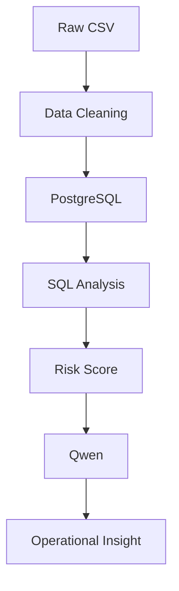

# Operational Insight Dashboard

> 고객 지원 티켓 데이터를 기반으로  
> 운영 리스크를 정량화하고,  
> 우선 대응 영역을 도출하기 위한 데이터 분석 프로젝트

<br>

## Project Overview

단순 문의량 분석만으로는 **실제 운영 리스크**를 파악하기 어렵다.

본 프로젝트는

- **Reopened Rate**
- **Resolution Time**
- **Priority**

를 결합한 **Risk Score**를 설계하여

운영팀이 우선 대응해야 할 영역을 식별하고,

Qwen 기반 LLM을 활용하여  
분석 결과를 **운영 인사이트 및 개선안**으로 변환하는 시스템을 구축하였다.

<br>

| 항목 | 내용 |
|------|------|
| Domain | Customer Support Operations |
| Goal | 운영 리스크 분석 |
| Dataset | 2,800 Tickets |
| Database | PostgreSQL |
| Dashboard | Streamlit |
| LLM | Qwen (Ollama) |

---

## Problem

> 운영팀은 수많은 고객 문의를 처리하지만,  
> 단순 문의량만으로는 실제 운영 리스크를 판단하기 어렵다.

- 처리시간이 길다고 반드시 위험한 것은 아니다.
- 문의량이 많다고 반드시 우선 대응 대상은 아니다.
- 재오픈된 티켓은 운영 비용 증가와 고객 경험 저하로 이어질 수 있다.
- 운영 담당자는 빠르게 우선순위를 판단할 수 있어야 한다.

**그래서 Risk Score 기반 운영 우선순위 도출 시스템을 설계하였다.**

---

## Analysis Questions

- 어떤 문의 유형이 가장 높은 운영 리스크를 갖는가?
- 어떤 영역에 운영 리소스를 우선 배치해야 하는가?
- 재오픈율이 높은 문의 유형은 무엇인가?
- SQL 분석 결과를 운영 인사이트로 자동 변환할 수 있는가?

---

## Data Overview

<details>
<summary>데이터 세부사항</summary>

데이터 출처 : Kaggle Customer Support Ticket Satisfaction Analysis  
총 데이터 수 : **2,800건**  
분석 단위 : 고객 지원 티켓

| 컬럼 | 설명 |
| --- | --- |
| `ticket_id` | 티켓 고유 ID |
| `issue_category` | 문의 유형 |
| `priority` | 티켓 우선순위 |
| `first_response_minutes` | 최초 응답까지 걸린 시간 |
| `resolution_time_hours` | 해결까지 걸린 시간 |
| `agent_experience_years` | 상담 담당자 경험 연차 |
| `reopened` | 재오픈 여부 |
| `channel` | 문의 채널 |
| `customer_satisfaction` | 고객 만족도 참고 지표 |

</details>

---

## System Flow



<details>
<summary>파이프라인 상세 설명</summary>

**Raw CSV** : Kaggle 고객 지원 티켓 데이터 사용.  
**Data Cleaning** : 날짜, 숫자, boolean 값 정제.  
**PostgreSQL** : 정제 데이터를 `customer_support_tickets` 테이블에 적재.  
**SQL Analysis** : 재오픈율, 처리시간, 우선순위 기반 운영 지표 계산.  
**Risk Score** : 운영 우선순위 산출.  
**Qwen** : SQL 분석 결과를 자연어 인사이트로 변환.  
**Operational Insight** : 리스크 요약, 우선 대응 영역, 개선안 제공.

</details>

---

## EDA

### 1. Operational Overview


### Key Findings

- **Total Tickets : 2,800**
- **Reopened Rate : 49.54%**
- **Avg Resolution Time : 36.56h**
- **Avg First Response Time : 123.02min**

### Business Insight

전체 티켓의 **약 절반이 재오픈**되었다.

이는 단순 처리 완료 건수보다  
**재오픈율이 운영 품질을 설명하는 핵심 지표**일 수 있음을 시사한다.

---

### 2. Resolution Time by Issue Category


### Key Findings

- **Account : 37.66h**
- **Other : 37.07h**
- **Technical : 36.63h**
- **Delivery : 36.39h**
- **Billing : 35.05h**

### Business Insight

**Account와 Other는 평균 처리시간이 상대적으로 길다.**

다만 처리시간만으로 운영 우선순위를 정하면  
재오픈율이나 Priority가 반영되지 않는다.

따라서 처리시간은  
**Risk Score의 한 요소로 결합해 해석**해야 한다.

---

### 3. Risk Score Analysis


### Risk Ranking

| Rank | Category | Risk Score |
|------|----------|------------|
| 1 | **Other** | **0.8536** |
| 2 | **Delivery** | **0.6431** |
| 3 | **Technical** | **0.6105** |

### Interpretation

**Other가 가장 높은 Risk Score를 기록했다.**

이는 Other 문의 자체가 위험하다는 의미가 아니다.

> 문의 분류 체계가 충분히 세분화되지 않았을 가능성

을 보여주는 신호로 해석할 수 있다.

Other에 다양한 문의가 섞여 있으면  
반복 이슈를 식별하기 어렵고,  
처리 가이드나 자동응답 정책도 정교하게 설계하기 어렵다.

---

## Risk Score Design

운영팀은 단일 지표만으로 우선순위를 판단하기 어렵다.

그래서 본 프로젝트에서는

- **Reopened Rate**
- **Resolution Time**
- **Priority**

를 결합하여 **Risk Score**를 설계했다.

```text
Risk Score =
0.5 × Reopened Rate
+ 0.3 × Resolution Time
+ 0.2 × Priority Weight
```

Priority Weight :

```text
Low = 1
Medium = 2
High = 3
Urgent = 4
```

> Risk Score는 운영 리소스를 어디에 먼저 투입할지 판단하기 위한 우선순위 지표이다.

---

## Why LLM?


SQL 분석 결과는 숫자와 테이블 형태로 제공된다.

하지만 운영 담당자가 실제로 필요한 것은

> 그래서 무엇을 해야 하는가?

이다.

Qwen은 분석 결과를 입력받아

- **운영 리스크 요약**
- **우선 대응 영역 제안**
- **운영 개선안 생성**

을 수행한다.

즉,

> Data  
> → Analysis  
> → Decision Making

사이의 간극을 줄이는 역할을 수행한다.

---

## Operational Strategy

### 1. Other 문의 재분류

Other는 **Risk Score 1위** 영역이다.  
세부 분류를 통해 반복 이슈를 식별하고, 별도 처리 정책을 설계해야 한다.

### 2. Delivery 처리 가이드 표준화

Delivery는 Risk Score 상위 영역이다.  
상황별 대응 기준을 표준화해 처리 편차와 재오픈 가능성을 낮춰야 한다.

### 3. Technical FAQ 강화

Technical 문의는 반복 질문과 처리 부담이 함께 발생할 수 있다.  
FAQ와 자동응답을 강화해 처리시간과 재오픈 가능성을 줄일 수 있다.

### 4. Phone 채널 상담 품질 점검

Phone 채널은 재오픈율이 가장 높게 나타났다.  
상담 기록, 후속 조치, 에스컬레이션 기준을 점검해야 한다.

---

## Final Insight

> 운영 리스크는 단순 문의량이 아니라  
> **재오픈율, 처리시간, 우선순위**를 함께 고려해야 한다.

> 높은 Risk Score는  
> 운영 우선순위를 결정하는 데 활용될 수 있다.

> SQL 분석 결과를 LLM으로 해석함으로써  
> 운영 의사결정을 지원할 수 있다.

---

## Tech Stack


