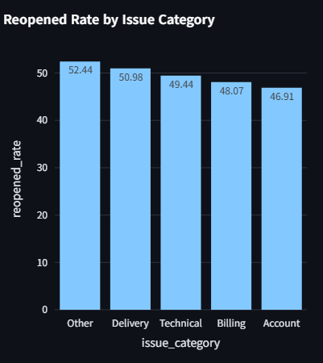
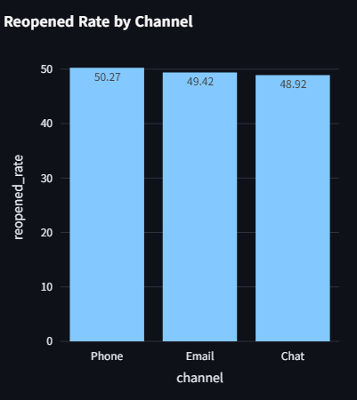
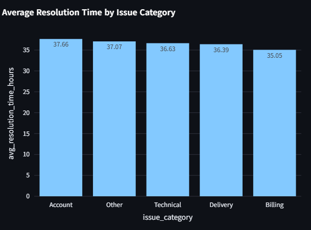
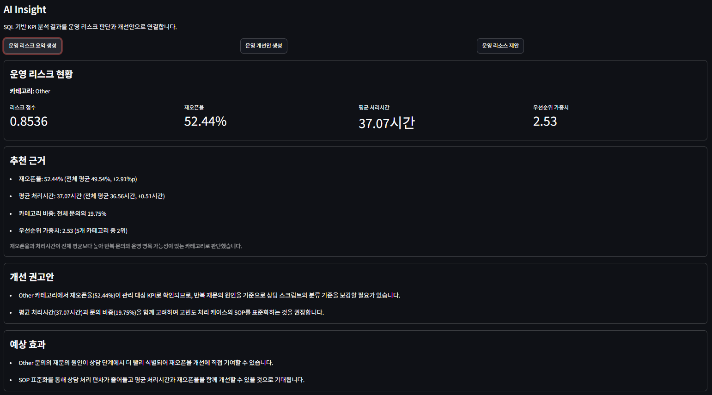
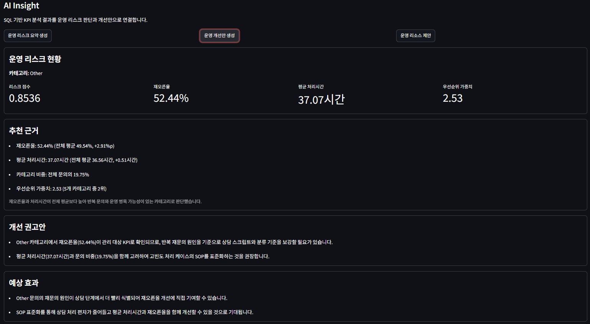
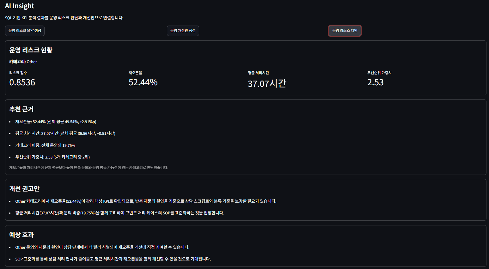

# 고객 지원 티켓 데이터 기반 운영 리스크 분석 프로젝트

CS 운영 데이터를 분석하여 반복 문의, 처리 지연, 우선순위 부담을 정량화하고 운영 리스크를 평가하는 시스템입니다.

재오픈율, 처리시간, 우선순위를 통합한 <strong>Risk Score</strong>를 설계하여 데이터 기반으로 개선 우선순위를 도출할 수 있도록 했습니다.

## 프로젝트 개요

Kaggle Customer Support Tickets Dataset의
<strong>2,800건</strong> 티켓 데이터를 분석했습니다.

> 문의량이 많은 영역이<br>
> 정말 가장 위험한 영역일까?

확인해보니 재오픈율, 처리시간, 우선순위는
서로 다른 위험 신호를 보여주고 있었습니다.

그래서 재오픈율, 처리시간, 우선순위를
통합 평가하는 <strong>Risk Score</strong>를 설계했습니다.

| 항목 | 내용 |
| --- | --- |
| 데이터 | Kaggle Customer Support Ticket Satisfaction Analysis |
| 분석 단위 | 고객 지원 티켓 <strong>2,800건</strong> |
| 핵심 목표 | 운영 리스크 정량화 및 개선 우선순위 도출 |
| 주요 지표 | 재오픈율, 처리시간, 우선순위 |
| 결과물 | Streamlit Operational Insight Dashboard |

## 왜 이 프로젝트를 시작했는가?

문의량이 많은 영역이
가장 위험한 영역인지 먼저 확인했습니다.

하지만 데이터를 분석해보니
문의량만으로는 운영 리스크를 설명하기 어려웠습니다.

재오픈된 티켓에서 반복 문의 가능성을 발견했습니다.

재오픈은 반복 문의와
추가 운영 비용으로 이어질 수 있습니다.

> 그래서 재오픈율을<br>
> 운영 품질을 설명하는 핵심 KPI로 볼 수 있다고 판단했습니다.

## 문제 정의

분석을 진행할수록
단일 지표로는 설명되지 않는 지점이 보였습니다.

> 문의량이 많다고<br>
> 운영 리스크가 높은 것은 아니었습니다.<br>
> 재오픈율이 높은 영역과<br>
> 처리시간이 긴 영역도 서로 달랐습니다.

> 재오픈율, 처리시간, 우선순위를 함께 고려했을 때<br>
> 어떤 영역을 먼저 개선해야 하는가?

## 분석 흐름

> 전체 재오픈율은 <strong>49.54%</strong>였습니다.

재오픈율이 운영 품질을 설명하는
핵심 신호라고 판단했습니다.

↓

### EDA 1

Issue Category 기준 재오픈율을 확인했습니다.

Other 카테고리의 재오픈율이
<strong>52.44%</strong>로 가장 높았습니다.

↓

### EDA 2

Channel 기준 재오픈율을 확인했습니다.

Phone 채널의 재오픈율이
<strong>50.27%</strong>로 가장 높았습니다.

↓

### EDA 3

처리시간 기준으로 다시 확인했습니다.

재오픈율 기준으로는 Other가 높았지만,
처리시간 기준으로는 Account가 <strong>37.66h</strong>로 가장 높았습니다.

↓

> 단일 KPI만으로는<br>
> 운영 리스크를 설명하기 어렵다는 결론에 도달했습니다.

↓

### Risk Score 설계

그래서 Reopened Rate,
Resolution Time,
Priority Weight를 하나의 점수로 통합했습니다.

Risk Score 1위는 <strong>Other</strong>였고,
점수는 <strong>0.8536</strong>이었습니다.

분석은 SQL과 Pandas를 중심으로 진행했고,
계산된 KPI와 Risk Score를 Streamlit 대시보드로 시각화했습니다.

## 데이터 개요

| 컬럼 | 설명 |
| --- | --- |
| `issue_category` | 문의 유형 |
| `channel` | 문의 채널 |
| `priority` | 티켓 우선순위 |
| `resolution_time_hours` | 해결까지 걸린 시간 |
| `reopened` | 재오픈 여부 |
| `agent_experience_years` | 상담 담당자 경험 연차 |
| `customer_satisfaction` | 고객 만족도 참고 지표 |

## 탐색적 데이터 분석 (EDA)

EDA는 데이터를 다각도로 관찰하며 주요 특성과 패턴을 파악하는 초기 분석 단계입니다.

운영 리스크를 설명할 수 있는 지표를 찾기 위해 문의 유형, 채널, 처리시간 기준으로 데이터를 나누어 확인했습니다.

### EDA 1. Issue Category 기준 재오픈율 분석



<strong>핵심 수치</strong>
- Other: <strong>52.44%</strong>
- Delivery: <strong>50.98%</strong>
- Technical: <strong>49.44%</strong>

<strong>해석</strong>
- Other 카테고리의 재오픈율이 가장 높게 나타났습니다.
- 여러 문의 유형이 한 카테고리에 섞여 있을 가능성을 운영 리스크로 해석했습니다.

<strong>운영 개선 연결</strong>
- 반복 키워드 기반 세부 카테고리 분리 검토

### EDA 2. Channel 기준 재오픈율 분석



<strong>핵심 수치</strong>
- Phone: <strong>50.27%</strong>
- Email: <strong>49.42%</strong>
- Chat: <strong>48.92%</strong>

<strong>해석</strong>
- Phone 채널의 재오픈율이 가장 높게 나타났습니다.
- 상담 기록, 후속 조치, 에스컬레이션 기준 점검이 필요한 접점으로 해석했습니다.

<strong>운영 개선 연결</strong>
- 상담 가이드 및 QA 샘플링 점검

### EDA 3. 처리시간 기준 분석



<strong>핵심 수치</strong>
- Account: <strong>37.66h</strong>
- Other: <strong>37.07h</strong>
- Technical: <strong>36.63h</strong>

<strong>해석</strong>
- 처리시간 기준으로는 Account가 가장 높게 나타났습니다.
- 재오픈율 기준 결과와 처리시간 기준 결과가 달라 단일 KPI의 한계를 확인했습니다.

<strong>운영 개선 연결</strong>
- 처리시간 상위 문의 SOP 점검

## Risk Score 설계

재오픈율만 보면
<strong>Other</strong>가 가장 위험했습니다.

채널 기준으로는
<strong>Phone</strong>이 가장 높은 재오픈율을 보였습니다.

하지만 처리시간을 보니
<strong>Account</strong>가 더 큰 운영 부담을 보였습니다.

KPI에 따라 위험 영역이 다르게 나타나,
단일 KPI만으로는 운영 개선 우선순위를 판단하기 어려웠습니다.

그래서 재오픈율,
처리시간,
우선순위를 하나의 점수로 통합한
Risk Score를 설계했습니다.

<strong>통합 지표</strong>
- <strong>Reopened Rate</strong>: 반복 문의와 고객 경험 저하 가능성
- <strong>Resolution Time</strong>: 처리 병목과 운영 리소스 부담
- <strong>Priority Weight</strong>: 긴급도에 따른 대응 부담

```text
Risk Score =
0.5 x Normalized Reopened Rate
+ 0.3 x Normalized Resolution Time
+ 0.2 x Normalized Priority Weight
```

<strong>결과</strong>
- Risk Score 1위: <strong>Other</strong>
- Risk Score: <strong>0.8536</strong>

Risk Score는 개별 KPI를 따로 보는 대신,
운영 리소스를 어디에 먼저 투입할지 판단하기 위한 기준입니다.

## Dashboard

대시보드는 KPI 조회를 넘어 운영 문제 판단과 개선 방향 도출까지 이어지도록 구성했습니다.

### 운영 리스크 현황



Risk Score가 높은 카테고리의 추천 근거, 재오픈율, 처리시간, 우선순위 가중치를 함께 제공합니다.

### 개선 권고안



SQL/Risk Score 결과를 바탕으로 개선 권고안과 예상 효과를 문장형으로 제공합니다.

### 운영 리소스 제안



고위험 영역에 대해 QA 샘플링, 상담 가이드 점검, 운영 리소스 배치를 검토할 수 있도록 정리합니다.

## 운영 개선 방향

| 영역 | 근거 | 개선 방향 |
| --- | --- | --- |
| 문의 분류 체계 | Other 재오픈율 <strong>52.44%</strong> | 반복 키워드 기반 세부 카테고리 분리 |
| 상담 품질 | Phone 재오픈율 <strong>50.27%</strong> | 상담 가이드 및 QA 샘플링 점검 |
| 처리 프로세스 | Account 처리시간 <strong>37.66h</strong> | 처리시간 상위 문의 SOP 점검 |
| 운영 관리 | Risk Score 1위 <strong>Other</strong> | Risk Score 기반 주간 모니터링 |

## 프로젝트를 통해 얻은 인사이트

> 문의량이 많다고<br>
> 운영 리스크가 높은 것은 아니었습니다.

> 재오픈율은 중요한 품질 KPI였지만,<br>
> 그것만으로는 우선순위를 결정할 수 없었습니다.

> 처리시간과 우선순위를 함께 고려했을 때<br>
> 개선이 필요한 영역을 더 설득력 있게 판단할 수 있었습니다.

> 이 프로젝트의 핵심은<br>
> 운영 데이터를 분석해<br>
> 개선 우선순위를 판단하는 기준을 만드는 것이었습니다.

## 실행 방법

```bash
pip install -r requirements.txt
streamlit run dashboard/app.py
```

## 기술 스택


